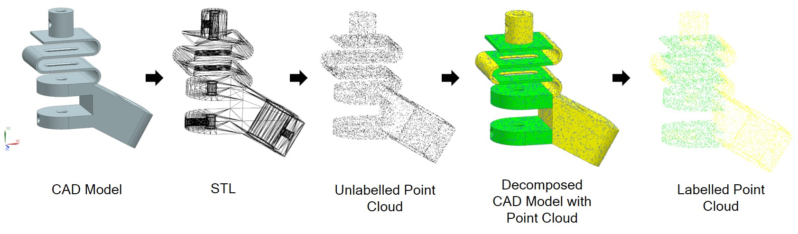

# Point Cloud Creation From CAD Models
## About
CAD models are often represented as a **boundary representation B-Rep**. However, a machine learning algorithm requires a fixed input size across the entire dataset, which is not apparent for B-Rep models. Therefore, CAD models needed to be converted into a secondary representation such as **point clouds**.

Code provided on [GitLab](https://gitlab.com/qub_femg/machine-learning/point-cloud-creation-from-cad-models/-/tree/master) can be used to help with the creation and labeling of a point cloud dataset from CAD models. In short, the CAD model is discretized into a stl mesh, which is used to create a point cloud. This point cloud is superimposed onto the CAD model. Bounding boxes of each face in the CAD model are found. The points are linked to a face if it lies within the bounding box. 

This method allows for the creation of point clouds for CAD models that have been decomposed for mesh generation.

The paper on which this code is based can be found [here](http://cad-journal.net/files/vol_18/CAD_18(4)_2021_760-771.pdf).

## Citation
Please cite this work if used in your research:

    @article{Point Cloud Dataset Creation for Machine Learning on CAD Models 2020,
      Author = {Andrew R. Colligan, Trevor. T. Robinson, Declan C. Nolan, Yang Hua},
      Journal = {Computer-Aided Design and Applications},
      Title = {Point Cloud Dataset Creation for Machine Learning on CAD Models},
      Year = {2020}
      URL = {http://cad-journal.net/files/vol_18/CAD_18(4)_2021_760-771.pdf}
    }

